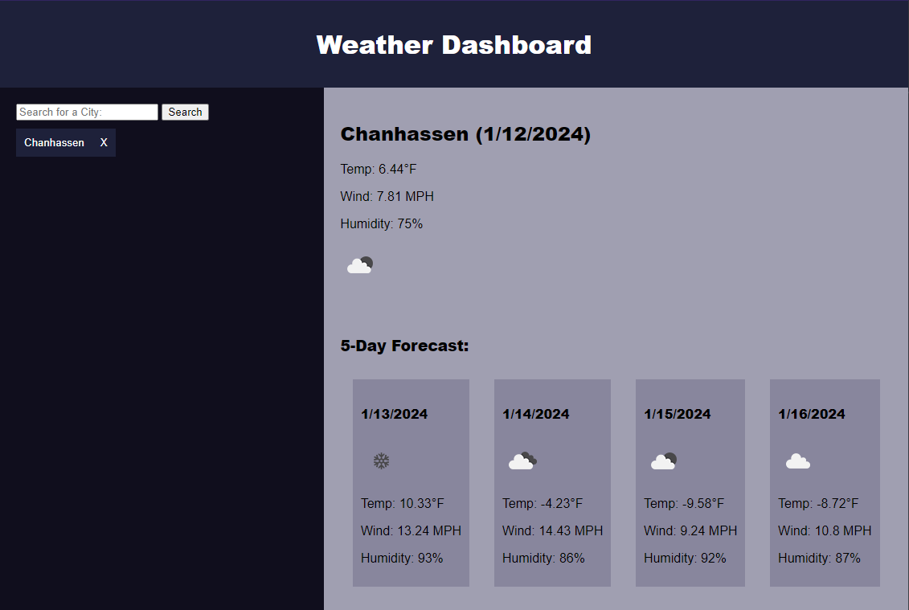

# Weather Dashboard

## Live Link
https://db-doo.github.io/five-day-weather/
## Screenshot

## Description
A simple and interactive weather dashboard that allows users to search for weather forecasts in different cities. This application fetches data from the OpenWeatherMap API and displays current weather conditions along with a 5-day forecast.

## Features
- Search for a city to view its current weather conditions.
- View a 5-day weather forecast for the selected city.
- Responsive design for optimal viewing on different devices.
- Search history that allows users to quickly revisit previously searched cities.
- Ability to delete cities from the search history.

## Technologies Used
- HTML
- CSS
- JavaScript
- OpenWeatherMap API